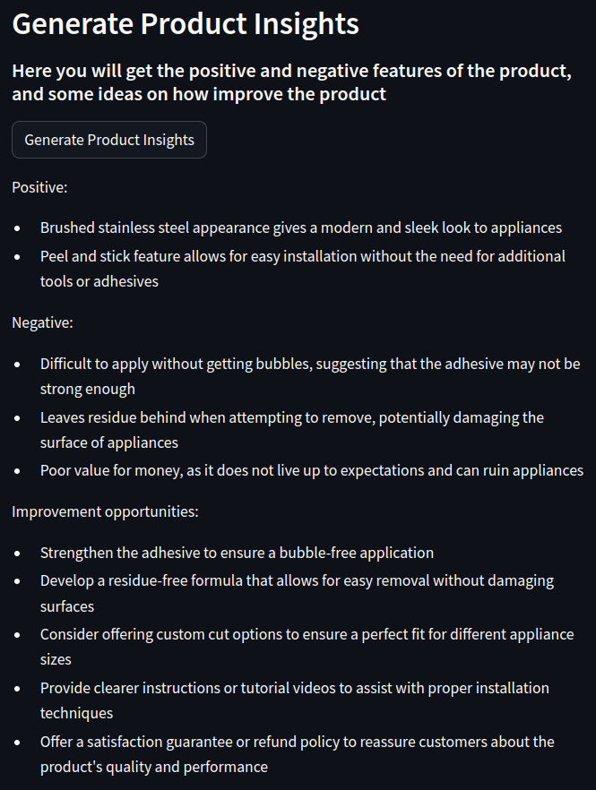
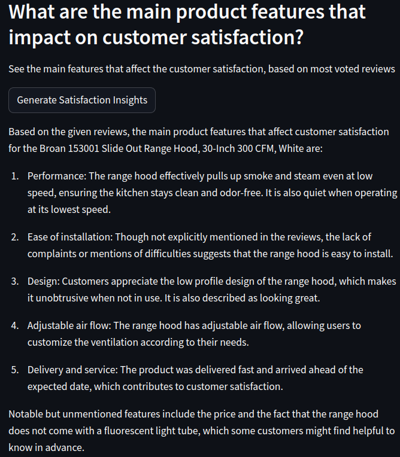
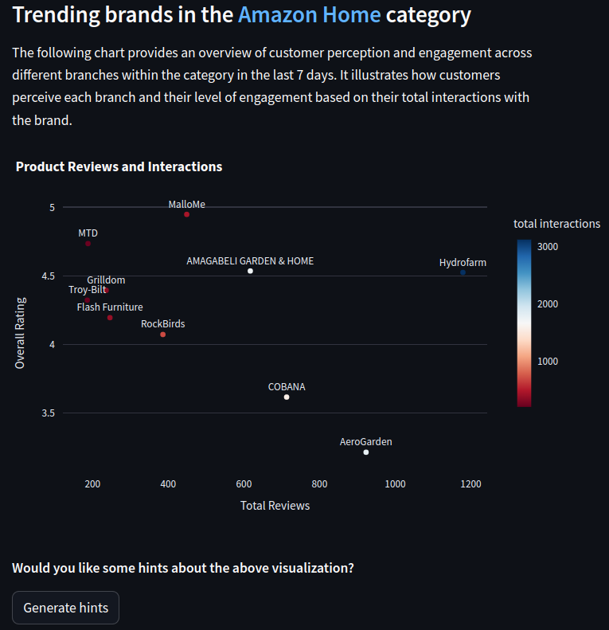
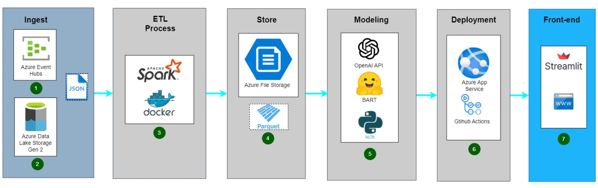

# Project name: *factored datathon 2023 - datacticos*

## Table of Contents 
- [Description](#description)
- [Features](#features)
- [Project Structure](#project-structure)
- [Deployment](#Deployment)
- [Screenshots](#Screenshots)
- [The Development](#the-development)
- [The Team](#the-team)

## Description 

The primary objective of this project is to create an analytical tool capable of aiding the decision-making process by leveraging Amazon reviews. The tool will empower users to grasp customers' sentiments regarding products, highlight essential insights from the extensive pool of Amazon reviews, and offer relevant indicators for comprehending product performance in the market.

## Features 

- **Check customer reviews in historical and streaming timeview.**
- **Automatic summarization of good or bad reviews on demand.**
- **Insights extraction from product reviews and identification of areas for improvement for each product.** 
- **A comprehensive set of analytics is provided to help you understand how customers perceive your brand and products.**
- **A collection of analytics is available to offer insights into trending products and brands based on the latest reviews and interactions data from the past few days.**

## Project Structure

The project is composed of different directories used in different stages during the development of the project

* DataPipeline: Contains the files regarding to the ETL process of the data.
* DownloadData: Files used to download the batch data from the azure datalake.
* EDA: Contains different exploratory data analysis useful to understand the nature of the data.
* Frontend: Main folder of the project, it contains all the programing logic to develop the products and make it available through a streamlit application.
* Models: Contains the tests of the different models used during the summarization tasks of the project.
* Streaming: Files used to get the streaming data.

## Deployment
You can take a look of the final product here: https://datacticos-datathon.azurewebsites.net/

## Screenshots 
* Image 1
  

*Here's an illustration showcasing the capabilities of our tool, providing valuable insights into product reviews.*

* Image 2
  

*This image demonstrates how our tool can identify the key factors contributing to customer satisfaction or dissatisfaction with a specific product.*

* Image 3
  

*In this example, our tool enables you to analyze various companies within a sector and their interactions with customers.*

## The Development

### Architecture

### EDA
Before starting with the development of our application, we did EDA to have a better understanding of the original dataset, this let us select which filters and transformations to apply, and generate ideas of which insights we can get for our final product. We worked on Jupyter Notebooks, Pandas and Spark.

### Data engineering
Our data pipeline starts by downloading the batch data from Azure Datalake using a python script, then it is filtered, cleaned and transformed using a Spark Docker Container. Filters include only verified purchases and reviews with at least 2 helpful votes, this to ensure input data quality to improve the tool performance. Streaming data is also downloaded from Azure Event Hub and processed with similar transformations as the batch data. The output data is in parquet format and then stored in Azure File Storage to be consumed by the app.

### Machine Learning
We use OpenAI GPT3.5 API to identify various insights such as positive and negative features of a product and improvement opportunities. The API allows the processing of the reviews in a fast automated form so the brand doesn’t have to read the reviews one by one. 
We use BART pretrained model to make a summarization of the most relevant reviews for any brand or product, offering the brand a more detailed view.
We also use sentiment analysis to classify product reviews in positive and negative, in order to show analytics and statistics. It is performed using the NLTK library.

### Analytics
Our tool provides valuable information through interactive visualizations that support the decision-making process. Python libraries like Pandas, Plotly, and Streamlit were used to provide the following information:
- Batch data:
Brand reviews activity in time - 
Brand Overall Rating over Time - 
Brand Customer Satisfaction - 
Product Performance KPI - 
Sentiment Analysis of product reviews
- Streaming data:
Trending products for category - 
Sentiment Analysis of trending products - 
Analysis of brand perception, engagement, and popularity

### Frontend and Backend
The application is built using Streamlit. It is used to read the gold data from Azure File Storage, do additional data manipulation for data visualization in an interactive user interface, and it is also used to load the BART model for summarization and connect with APIs as the OpenAI’s GPT API.

### Deployment
The deployment is done using Azure App Service. Azure App service integrates with Github Actions for Continuous Deployment, any change in the connected repository’s branch will lead to a new build and deployment of the application. The master data needed for the application to run, is stored in Azure File Storage and connected with the application.

## The team

* [@YhBedoya](https://github.com/YhBedoya)
* [@ceronvgabriel](https://github.com/ceronvgabriel)
* [@diegoecon-ai](https://github.com/diegoecon-ai)